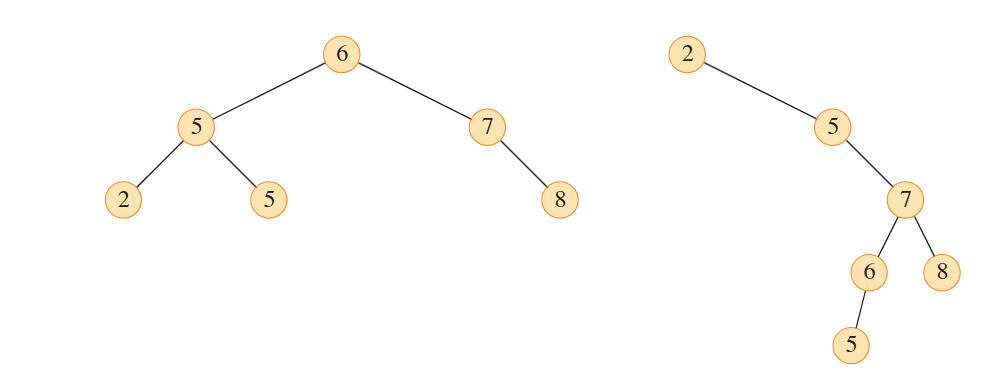

# Binary Search Trees

- [Binary Search Trees](#binary-search-trees)
- [What is a Binary Search Tree?](#what-is-a-binary-search-tree)
  - [Representing a Binary Search Tree](#representing-a-binary-search-tree)
- [Searching in a Binary Search Tree](#searching-in-a-binary-search-tree)


***
The search tree data structure supports each of the following dynamic set operations:
1. SEARCH
2. MINIMUM
3. MAXIMUM
4. PREDECESSOR
5. SUCCESSOR
6. INSERT
7. DELETE

Thus, a search tree can be used both as a dictionary and as a priority queue.

Basic operations on a Binary Search Tree take time proportional to the height of the tree. For a complete binary tree with n nodes, the operations run in $\Theta (log n)$ time, but for a chain of n nodes, the operations run in $\Theta (n)$ time, which is the worst case scenario. The expectation value of the height of a binary tree is $\log n$ and is thus it is more efficient.

# What is a Binary Search Tree?

A binary search tree is organized as a Binary Tree. You can represent such a tree with a linked data structure. In addition to a *key* and satellite data, each node object contains attributes *left, right* and *priori* that point to the left subchild, right subchild and and the parent respectively. If any of the parent or child values are missing, the corresponding attribute contains the value NIL. The tree itself has an attribute *root* that is pointing to the root node, or NIL if the tree is empty. The root node, given by $T.root$ is the only node in a tree whose parent is NIL. 

The nodes in a Binary Search Tree obey the binary search tree property:

>Let $x$ be a node in a binary search tree. If $y$ is a node in the left subtree of $x$, then $y.key \le x.key$. If $y$ is a node in the right subtree of $x$, then $y.key \ge x.key$.

Because of the Binary Search Tree property, the tree could be completely skewed.  The following image shows the same set of numbers represented as two different binary search trees with different root nodes.


**Leaf Node:** A node in a binary search tree without any children

**Internal Node:** Any Node that is not the root node or a leaf node. It has a parent node and a child node.

## Representing a Binary Search Tree

A binary Search Tree is represented in a computer program with an Array, with indexing taking a special approach. The root node is at the beginning of the array. The Left child of the $i$th node is stored at the index $2i$ and the right child is stored at the index $2i + 1$. 

# Searching in a Binary Search Tree

To search in a binary search tree, we call the TREE-SEARCH algorithm. The structure of the binary search tree lends itself easily to recursive routines.

```pseudocode
TREE-SEARCH(x, k)
1. if x == nil or k == x.key
2.  return x
3. if k < x
4.  return TREE-SEARCH(x.left, k)
5. else
6.  return TREE-SEARCH(x.right, k)
```

The TREE-SEARCH procedure begins it's search at the root node, and compares with each node. If the comparision is positive,  it returns the value itself. Otherwise, it checks if the value is greater or lesser, and repeats the TREE-SEARCH with the corresponding left or right subtree.

In order to search for the minimum value in the tree, you look for the left most leaf node, and for the maximum value in the tree, you look for the right most leaf node.

