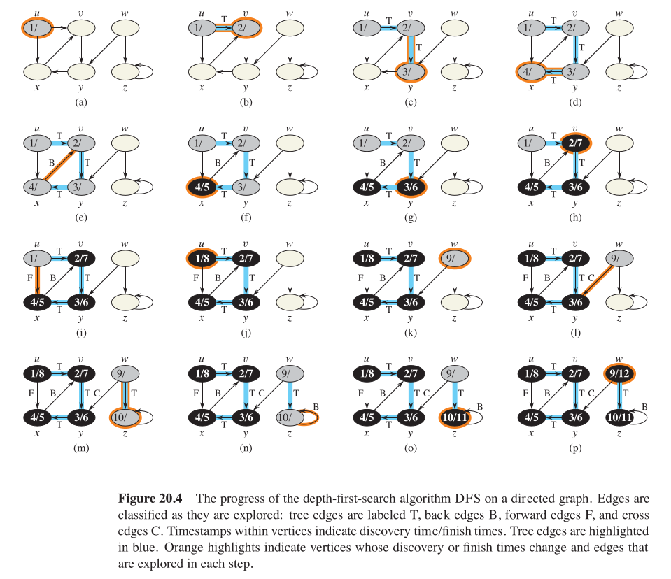
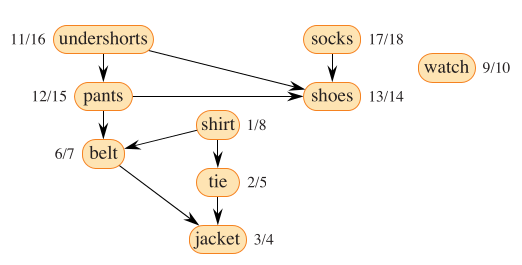
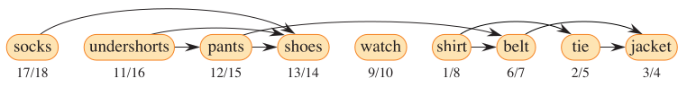

# Depth First Search

- [Depth First Search](#depth-first-search)
  - [DFS Logic](#dfs-logic)
  - [Pseudocode for DFS](#pseudocode-for-dfs)
    - [Explanation of The Pseudocode](#explanation-of-the-pseudocode)
  - [Time Complexity of DFS](#time-complexity-of-dfs)
- [Application of DFS: Topological Sort](#application-of-dfs-topological-sort)


## DFS Logic

As its name implies, depth first search searches "deeper" in the graph whenever possible. Depth first search explores edges out of the most recently discovered vertex $v$ that still has unexplored edges leaving it. Once all of $v$ ’s edges have been explored, the search "backtracks" to explore edges leaving the vertex from which v was discovered. This process continues until all vertices that are reachable from the original source vertex have been discovered. If any undiscovered vertices remain, then depth-ûrst search selects one of them as a new source, repeating the search from that source. The algorith repeats this process until every vertex is discovered.

Like BFS, we color the vertices as we go. Each vertex is initially white, and is grayed when it is discovered in the search, and it blacked when it is finished (ie, when it's adjacency list is completely discovered). 

With each vertex, we hold two timestamps, one is $v.d$, which holds information about when the vertex was discovered, and the other is $v.f$, when the vertex is fully examined. Obviously, $u.d < u.f$ for any vertex $u$ in the graph. These timestamps provide information about the structure of the graph, and are generally helpful in reasoning about the behaviour of DFS.

## Pseudocode for DFS

```pseudocode
DFS(G)
for each vertex u in G.vertices
    u.color = white
    u.pi = NIL
time = 0
for each vertex u in G.vertices:
    if u.color == white:
        DFS-visit(G,u)
    
DFS-visit(G,u)
time = time + 1
u.d = time
u.color = Gray
for each vertex v in G.adj(u)
    if v.color = white:
        v.pi = u
        DFS-visit(G,u)
time = time + 1
u.f = time
u.color = Black
```

### Explanation of The Pseudocode

The DFS algorithm works as follows: 
1. Lines 1-3 paint all the vertices white and initialize their priori atttributes to NIL.
2. Line 4 resets the global time counter 
3. Lines 5-7 check each vertex in V in turn, and when a white vertex is found, visit it by calling DFS visit.

DFS Visit subroutine works as follows: 
1. Upon every call of DFS visit at vertex $u$, the DFS increments the time counter, and updates the $u$'s dime of discovery as the current time.
2. For each of the adjacent vertices of $u$ that have not been previously visited (ie the color is white), which we refer to as $v$, the priori of $v$ is updated to be $u$, and the DFS subroutine is called on this vertex again.
3. Once it iterates through all the vertices adjacent to $u$, it again updates the global time counter and marks the finishing time of $u$, and the color is updated to be black.


## Time Complexity of DFS

During an execution of DFS, the subroutine DFS-Visit is called once per vertex, and it operates on all the adjacent vertices to the vertex it is called upon. Since $\sum _{v \epsilon V} |Adj(v)| = \Theta (E)$, the running time of DFS-Visit is given by $\Theta (V + E)$. The other sections of DFS algorithm are constant in time. Thus, the total running time of DFS is given by $\Theta (V + E)$.

# Application of DFS: Topological Sort

Topological Sort of a directed Acyclic Graph is a linear ordering of all it's vertices such that if $G$ contains an edge $(u,v)$, then $u$ appears before $v$ in the ordering. 

Think of topological sorting as an ordering of it's vertices along a horizontal line, such that all the directed edges go from left to right. 

Let us construct a directed acyclic graph for when Professor Bumstead is trying to get dressed in the morning. He must wear certain garments before he wears other garments. From that, we obtain the following Directed Acyclic Graph.


Applying a topological sort to this Graph, we can provide Professor Bumstead with an efficient order to get dressed. The output of the topological sort is the following:


The pseudocode for topological sort is given below:

```pseudocode
Call DFS(G) to compute finish times v.f for each verted v

As each vertex is finished, insert it to the front of a linked list

return the linked list of vertices
```

The only additional step to the typical DFS algorithm here is to add the vertices to the linked list, in the step where we update the finish time of the vertices in the DFS(G) algorithm. As such, the time complexity of the topological sort is also given by $\Theta (V + E)$. 